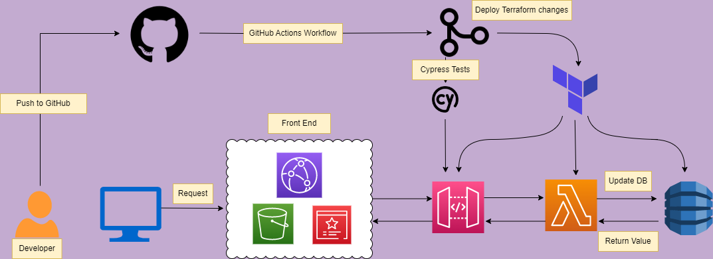

Cloud Resume Challenge 

I completed the Cloud Resume Challenge, which is a full stack project which utilizes AWS services.

My deployed resume website can be found<a href="https://chasedecosterresume.com/">here</a>.

FRONT-END DIAGRAM:

The frontend portion of this project was built using AWS S3, which hosted my static website consisting of HTML, CSS, and JavaScript files. I purchased my domain name from AWS Route53, which pointed internet traffic to a AWS CloudFront  distribution. Cloudfront would cache my files from S3, and serve my website content to users. AWS Certificate manager was also used to establish a TLS connection between the client, which provides a secure HTTPS connection. 

CI/CD
GitHub actions was used to sync my S3 bucket when code was uploaded to my repository. After files are uploaded, Cloudfront cache is invalidated, which provides real-time updates with any code/website changes.

BACKEND DIAGRAM:

The backend portion was built with IaC (Terraform) to provision AWS DynamoDB, Lambda and API Gateway services. Once the website is visited, Javascript code makes an API call to AWS API Gateway; this call then triggers a Lambda function written in Python, to access AWS DyanmoDB, and retreive the current visitor count data. It then will add 1+ to the count attribute, and returns the updated visitor count value and displays it on the screen/website. 

CI/CD
The backend uses GitHub Actions to update the changes made in the Terraform configuration files any time code is pushed to this repository. Cypress tests are also run on the API Gateway to make sure the Lambda function is returning usable data.